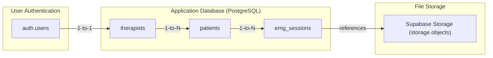
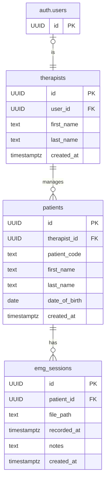

# GHOSTLY+ Supabase C# Proof of Concept

A .NET 7 console application that demonstrates a multi-tenant application structure using Supabase. The project focuses on Row-Level Security (RLS) for data segregation and compares two different C# clients for Supabase interaction.

The repository includes:
-   A multi-tenant RLS model for database and storage policies.
-   A comparison between the `supabase-csharp` client and a raw `HttpClient` implementation.
-   An automated test suite for validating the RLS policies.
-   Detailed technical documentation in the `/memory-bank` directory.

---

## Getting Started

### Prerequisites
-   .NET 7.0 SDK
-   A Supabase account and project.
-   Supabase CLI.

### Configuration
1.  **Clone the Repository**:
    ```bash
    git clone <repository-url>
    cd ghostly-supabase-poc-csharp
    ```

2.  **Environment Variables**: Create a `.env` file in the project root using `.env.example` as a template. Fill in your project-specific details.

3.  **Storage Buckets**: In your Supabase project dashboard, create two Storage buckets: `c3d-files` and `emg_data`.

4.  **Database Migrations**: Link your Supabase project and run the local migrations to set up the schema, RLS policies, and seed data.
    ```bash
    # One-time setup
    supabase link --project-ref <your-project-ref>

    # Wipes the remote database and applies all local migrations
    supabase db reset
    ```

### Running the Application
Build and run the project. The interactive menu provides access to the test suites.
```bash
dotnet run
```

---

## Project Structure

The repository is organized to separate concerns.

```
.
├── src/
│   ├── Clients/      # Contains the two client implementations for Supabase.
│   │   ├── SupabaseClient.cs   # Wrapper for the official `supabase-csharp` library.
│   │   └── CustomHttpClient.cs # A raw HTTP client for direct API interaction.
│   ├── Config/       # Manages environment variables and test configuration.
│   ├── Models/       # C# data models (POCOs) for database tables and API responses.
│   ├── RlsTests/     # The comprehensive multi-therapist RLS test suite.
│   ├── Utils/        # Shared utility classes for helpers and exceptions.
│   └── main.cs       # The application entry point and interactive menu.
│
├── supabase/
│   └── migrations/   # SQL scripts for database schema, RLS policies, and seed data.
│
├── memory-bank/      # Contains detailed, long-term project documentation.
│
├── .gitignore
└── main.csproj
```

---

## Database Schema

The architecture is composed of user authentication, a relational database, and file storage.

**High-Level Data Flow**


**Entity-Relationship Diagram (ERD)**


---

## Core Test Scenarios

The application's main menu provides access to two validation suites:

1.  **Client Comparison Suite**: Runs a sequence of tests for both client implementations against the `c3d-files` storage bucket to compare behavior and performance.

2.  **Multi-Therapist RLS Suite**: Validates the core multi-tenant security model. It uses the `emg_data` bucket to confirm a `therapist` user can only access data and files belonging to their assigned patients.

---

## Documentation

For details on the project's architecture, components, and security model, refer to the documentation in the `/memory-bank` directory. 