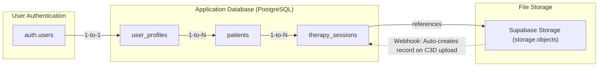
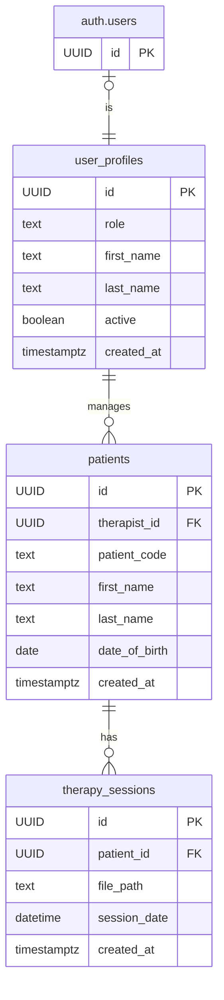

# GHOSTLY+ Supabase C# Proof of Concept

A .NET 9.0 console application that demonstrates a multi-tenant application structure using Supabase. The project focuses on Row-Level Security (RLS) for data segregation and compares two different C# clients for Supabase interaction.

The repository includes:
-   A multi-tenant RLS model for database and storage policies.
-   A comparison between the `supabase-csharp` client and a raw `HttpClient` implementation.
-   An automated test suite for validating the RLS policies.
-   Detailed technical documentation in the `/memory-bank` directory.

---

## Getting Started

### Prerequisites
-   .NET 9.0 SDK
-   A Supabase account and project (uses Supabase Cloud, but can be adapted for self-hosted).
-   Supabase CLI.

### Configuration
1.  **Clone the Repository**:
    ```bash
    git clone <repository-url>
    cd ghostly-supabase-poc-csharp
    ```

2.  **Set up credentials** (choose one method):
    
    **Option A: Using .env file (Recommended)**:
    ```bash
    cp .env.example .env
    # Edit .env with your Supabase credentials
    ```
    
    **Option B: Using appsettings.json**:
    ```bash
    cp appsettings.example.json appsettings.json
    # Edit appsettings.json with your credentials
    ```
    
    **Option C: Using environment variables directly**:
    ```bash
    export SUPABASE_URL="https://your-project.supabase.co"
    export SUPABASE_ANON_KEY="your-anon-key"
    ```
    
    > **Priority**: Environment variables override appsettings.json values

3.  **Storage Buckets**: In your Supabase project dashboard, create the Storage bucket: `emg_data`.

4.  **Database Migrations**: Link your Supabase Cloud project and apply migrations to set up the schema, RLS policies, and seed data.
    ```bash
    # One-time setup (links to Supabase Cloud instance)
    supabase link --project-ref <your-project-ref>

    # Wipes the remote database and applies all local migrations
    supabase db reset
    ```
    
    Note: This project is configured for Supabase Cloud. For self-hosted deployments, update the connection URLs in your `.env` file.

### Running the Application
Build and run the project. The interactive menu provides access to the test suites.
```bash
dotnet run
```

---

## Project Structure

The repository is organized to separate concerns.

```
.
├── src/
│   ├── Clients/      # Contains the two client implementations for Supabase.
│   │   ├── SupabaseClient.cs   # Wrapper for the official `supabase-csharp` library.
│   │   └── CustomHttpClient.cs # A raw HTTP client for direct API interaction.
│   ├── Config/       # Manages environment variables and test configuration.
│   ├── Examples/     # Sample code for common scenarios (e.g., mobile upload).
│   ├── Models/       # C# data models (POCOs) for database tables and API responses.
│   ├── RlsTests/     # The comprehensive multi-therapist RLS test suite.
│   ├── Utils/        # Shared utility classes for helpers and exceptions.
│   └── main.cs       # The application entry point and interactive menu.
│
├── supabase/
│   └── migrations/   # SQL scripts for database schema, RLS policies, and seed data.
│
├── memory-bank/      # Contains detailed, long-term project documentation.
│
├── .gitignore
└── main.csproj
```

---

## Database Schema

The architecture is composed of user authentication, a relational database, and file storage with automated webhook integration.

**High-Level Data Flow**


**Note**: A Supabase Storage webhook automatically creates a `therapy_sessions` record when a C3D file is uploaded, ensuring data consistency and automated tracking.

**Entity-Relationship Diagram (ERD)**


---

## 🔒 How Supabase RLS (Row-Level Security) Works

### What is RLS?
Row-Level Security is a PostgreSQL feature that Supabase uses to automatically filter data at the database level based on who's authenticated. It ensures complete data isolation between users without writing any filtering code in your application.

### How It Works in This Project

#### 1. **Authentication Context**
When a therapist authenticates:
```csharp
await client.AuthenticateAsync("therapist1@example.com", "password");
```
Supabase sets their `auth.uid()` in the database session context.

#### 2. **Automatic Filtering**
RLS policies automatically filter all queries:
```sql
-- This policy on the patients table
CREATE POLICY "Allow therapists to manage their assigned patients"
ON public.patients FOR ALL
USING (therapist_id = public.get_current_therapist_id())
```

When you query patients:
```csharp
var patients = await client.GetPatientsAsync();
// Returns ONLY patients where therapist_id matches the authenticated user
```

#### 3. **Security Guarantees**
- **Therapist 1** can NEVER see Therapist 2's patients
- **Therapist 2** can NEVER see Therapist 1's patients
- This happens at the database level - even direct SQL queries are filtered
- No application code can bypass these policies

### Example in Action
```csharp
// Therapist 1 authenticates
await client.AuthenticateAsync("therapist1@example.com", "password");
var patients = await client.GetPatientsAsync();
// Returns: [P001] - only their assigned patient

// Therapist 2 authenticates
await client.AuthenticateAsync("therapist2@example.com", "password");
var patients = await client.GetPatientsAsync();
// Returns: [P002] - only their assigned patient
```

### Storage RLS
The same principle applies to file storage:
```sql
CREATE POLICY "Allow therapists to upload files for assigned patients"
ON storage.objects FOR INSERT
WITH CHECK (
    bucket_id = 'emg_data' AND
    public.is_assigned_to_patient((storage.foldername(name))[1])
)
```

Files are organized as `{patient_code}/{filename}`, and therapists can only access files in folders for their assigned patients.

---

## Core Test Scenarios

The application's main menu provides access to two validation suites:

1.  **Client Comparison Suite**: Runs a sequence of tests for both client implementations to compare behavior and performance.

2.  **Multi-Therapist RLS Suite**: Validates the core multi-tenant security model. It uses the `emg_data` bucket to confirm a `therapist` user can only access data and files belonging to their assigned patients.

---

## Documentation

For details on the project's architecture, components, and security model, refer to the documentation in the `/memory-bank` directory. 