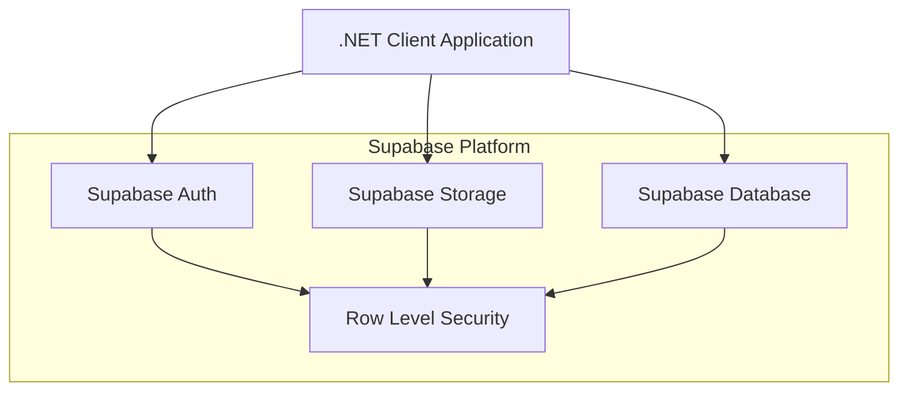

# Architecture Documentation

## System Architecture

### High-Level Architecture


### Component Overview
1. **Client Application**
   - Console-based .NET 7.0 application
   - Two implementation approaches:
     - Official Supabase client (`GhostlyPOC`)
     - Raw HTTP client (`GhostlyHttpPOC`)

2. **Authentication Layer**
   - Email/password authentication
   - JWT token management
   - Session handling

3. **Storage System**
   - Patient-specific folder structure
   - File upload/download capabilities
   - Access control via RLS

4. **Database Layer**
   - PostgreSQL with RLS policies
   - Therapist-patient relationship management
   - EMG session tracking

## Design Patterns

### 1. Repository Pattern
- Separation of data access logic
- Implemented in both Supabase and HTTP clients
- Consistent interface for storage operations

### 2. Factory Pattern
- Client initialization and configuration
- Environment-based configuration management

### 3. Strategy Pattern
- Interchangeable storage access strategies
- Allows comparison between Supabase SDK and HTTP approaches

## Data Flow

### Authentication Flow
1. User provides email/password
2. Credentials sent to Supabase Auth
3. JWT token received and stored
4. Token used for subsequent requests

### File Operations Flow
1. **Upload**:
   ```
   Client -> Auth -> RLS Check -> Storage Bucket -> Patient Folder
   ```

2. **Download**:
   ```
   Client -> Auth -> RLS Check -> Storage Bucket -> Local File System
   ```

3. **Listing**:
   ```
   Client -> Auth -> RLS Check -> Storage Bucket -> Filtered Results
   ```

## Security Considerations

### 1. Row Level Security (RLS)
- Database-level security policies
- Per-therapist data isolation
- Automatic filtering of unauthorized access

### 2. Storage Security
- Patient folder access control
- File operation authorization
- Secure upload/download paths

### 3. Authentication Security
- JWT token management
- Automatic token refresh
- Session timeout handling

### 4. General Security
- Environment variable configuration
- HTTPS communication
- Error handling and logging

## Database Schema

### Current Schema (Phase 1)
- Simple file storage structure
- Patient code-based organization

### Planned Schema (Phase 2)
```sql
-- Therapists table
CREATE TABLE therapists (
    id UUID PRIMARY KEY DEFAULT gen_random_uuid(),
    email TEXT UNIQUE NOT NULL,
    name TEXT NOT NULL,
    hospital TEXT DEFAULT 'UZ Brussels',
    created_at TIMESTAMP WITH TIME ZONE DEFAULT NOW()
);

-- Patients table
CREATE TABLE patients (
    id UUID PRIMARY KEY DEFAULT gen_random_uuid(),
    patient_code TEXT UNIQUE NOT NULL,
    therapist_id UUID REFERENCES therapists(id) NOT NULL,
    name TEXT NOT NULL,
    age INTEGER,
    hospital TEXT,
    created_at TIMESTAMP WITH TIME ZONE DEFAULT NOW()
);

-- EMG Sessions table
CREATE TABLE emg_sessions (
    id UUID PRIMARY KEY DEFAULT gen_random_uuid(),
    patient_id UUID REFERENCES patients(id) NOT NULL,
    therapist_id UUID REFERENCES therapists(id) NOT NULL,
    file_path TEXT NOT NULL,
    session_date TIMESTAMP WITH TIME ZONE DEFAULT NOW(),
    game_level INTEGER,
    score INTEGER,
    duration_minutes INTEGER
);
```

## Technical Decisions

### 1. Supabase vs Custom Backend
- **Decision**: Use Supabase for backend services
- **Rationale**: 
  - Built-in authentication
  - PostgreSQL with RLS
  - Managed file storage
  - Rapid development capability

### 2. Dual Client Implementation
- **Decision**: Implement both SDK and HTTP clients
- **Rationale**:
  - Performance comparison
  - Flexibility in implementation
  - Backup approach availability

### 3. .NET 7.0 Selection
- **Decision**: Use .NET 7.0 for development
- **Rationale**:
  - Modern features
  - Long-term support
  - Cross-platform compatibility

### 4. Storage Organization
- **Decision**: Patient-specific folders
- **Rationale**:
  - Natural data organization
  - Simplified access control
  - Easy RLS implementation

### 5. RLS over API-level checks
- **Decision**: Row-Level Security was chosen to enforce data access rules directly within the database, providing a more robust and centralized security model compared to application-level checks.
- **Rationale**:
  - More robust security model
  - Centralized control
  - Reduced complexity in application logic

### 6. Simplified 1:N Relationship
- **Decision**: The initial many-to-many model between therapists and patients was simplified to a one-to-many relationship (one therapist can have many patients, but a patient has only one therapist) to match the current business requirements and reduce complexity.
- **Rationale**:
  - Reduced complexity
  - Matches business requirements
  - Simplified data access control

## Project Structure (Post-Refactoring)
The project follows a clean, feature-oriented structure to separate concerns and improve maintainability:

- **`/src`**: Contains all C# source code.
    - **`/src/Models`**: Houses all Plain Old C# Object (POCO) data models (e.g., `Patient.cs`, `EmgSession.cs`). This ensures a single source of truth for data structures.
    - **`/src/Clients`**: Contains different client implementations for interacting with Supabase. This includes the cleaner versions of the original POCs (`LegacySupabaseClient.cs`, `LegacyHttpClient.cs`) and any new clients.
    - **`/src/RlsTests`**: Holds the specific test suite for validating the multi-therapist Row-Level Security implementation.
    - **`/src/Utils`**: Provides shared, generic utility classes (e.g., for environment variables, file operations).
- **`/supabase/migrations`**: Contains all SQL migration scripts, managed in chronological order.
- **`/memory-bank`**: Stores all project documentation and architectural decisions.
- **`main.cs`**: The main entry point of the application, located inside `/src`. 