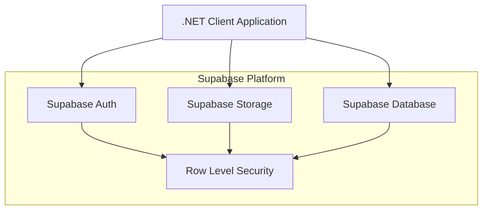

# Architecture Documentation

## System Architecture

### High-Level Architecture


### Component Overview
1. **Client Application**
   - Console-based .NET 7.0 application
   - Two implementation approaches:
     - Official Supabase client (`GhostlyPOC`)
     - Raw HTTP client (`GhostlyHttpPOC`)

2. **Authentication Layer**
   - Email/password authentication
   - JWT token management
   - Session handling

3. **Storage System**
   - Patient-specific folder structure
   - File upload/download capabilities
   - Access control via RLS

4. **Database Layer**
   - PostgreSQL with RLS policies
   - Therapist-patient relationship management
   - EMG session tracking

## Design Patterns

### 1. Repository Pattern
- Separation of data access logic
- Implemented in both Supabase and HTTP clients
- Consistent interface for storage operations

### 2. Factory Pattern
- Client initialization and configuration
- Environment-based configuration management

### 3. Strategy Pattern
- Interchangeable storage access strategies
- Allows comparison between Supabase SDK and HTTP approaches

## Data Flow

### Authentication Flow
1. User provides email/password
2. Credentials sent to Supabase Auth
3. JWT token received and stored
4. Token used for subsequent requests

### File Operations Flow
1. **Upload**:
   ```
   Client -> Auth -> RLS Check -> Storage Bucket -> Patient Folder
   ```

2. **Download**:
   ```
   Client -> Auth -> RLS Check -> Storage Bucket -> Local File System
   ```

3. **Listing**:
   ```
   Client -> Auth -> RLS Check -> Storage Bucket -> Filtered Results
   ```

## Security Considerations

### 1. Row Level Security (RLS)
- Database-level security policies
- Per-therapist data isolation
- Automatic filtering of unauthorized access

### 2. Storage Security
- Patient folder access control based on a readable `patient_code` (e.g., `P001`).
- RLS policies prevent unauthorized listing or access of patient folders.
- Secure file operation authorization via database helper functions.

### 3. Authentication Security
- JWT token management
- Automatic token refresh
- Session timeout handling

### 4. General Security
- Environment variable configuration
- HTTPS communication
- Error handling and logging

## Database Schema

### Implemented Schema
The schema uses a one-to-many relationship between therapists and patients. A human-readable `patient_code` is automatically generated for each patient and is used as the subfolder name in the storage bucket, enhancing readability and security.

```sql
-- Sequence for auto-generating patient codes (e.g., P001, P002)
CREATE SEQUENCE public.patient_code_seq;

-- Therapists table
CREATE TABLE public.therapists (
    id UUID PRIMARY KEY,
    user_id UUID UNIQUE NOT NULL REFERENCES auth.users(id),
    first_name TEXT NOT NULL,
    last_name TEXT NOT NULL
);

-- Patients table with readable, unique patient code
CREATE TABLE public.patients (
    id UUID PRIMARY KEY,
    therapist_id UUID NOT NULL REFERENCES public.therapists(id),
    patient_code TEXT NOT NULL UNIQUE DEFAULT ('P' || LPAD(nextval('patient_code_seq')::text, 3, '0')),
    first_name TEXT NOT NULL,
    last_name TEXT NOT NULL,
    date_of_birth DATE NOT NULL
);

-- EMG Sessions table
CREATE TABLE public.emg_sessions (
    id UUID PRIMARY KEY,
    patient_id UUID NOT NULL REFERENCES public.patients(id),
    file_path TEXT NOT NULL UNIQUE, -- e.g., "P001/P001_C3D-Test_20231027_123000.c3d"
    recorded_at TIMESTAMPTZ NOT NULL,
    notes TEXT
);
```

## Technical Decisions

### 1. Supabase vs Custom Backend
- **Decision**: Use Supabase for backend services
- **Rationale**: 
  - Built-in authentication
  - PostgreSQL with RLS
  - Managed file storage
  - Rapid development capability

### 2. Dual Client Implementation
- **Decision**: Implement both SDK and HTTP clients
- **Rationale**:
  - Performance comparison
  - Flexibility in implementation
  - Backup approach availability

### 3. .NET 7.0 Selection
- **Decision**: Use .NET 7.0 for development
- **Rationale**:
  - Modern features
  - Long-term support
  - Cross-platform compatibility

### 4. Storage Organization
- **Decision**: Patient-specific folders using a human-readable `patient_code` (e.g., `P001`).
- **Rationale**:
  - Natural data organization and improved readability over UUIDs.
  - Simplified and more secure access control.
  - Easy RLS implementation using the `patient_code` as the key.

### 5. RLS over API-level checks
- **Decision**: Row-Level Security was chosen to enforce data access rules directly within the database, providing a more robust and centralized security model compared to application-level checks.
- **Rationale**:
  - More robust security model
  - Centralized control
  - Reduced complexity in application logic

### 6. Simplified 1:N Relationship
- **Decision**: The initial many-to-many model between therapists and patients was simplified to a one-to-many relationship (one therapist can have many patients, but a patient has only one therapist) to match the current business requirements and reduce complexity.
- **Rationale**:
  - Reduced complexity
  - Matches business requirements
  - Simplified data access control 