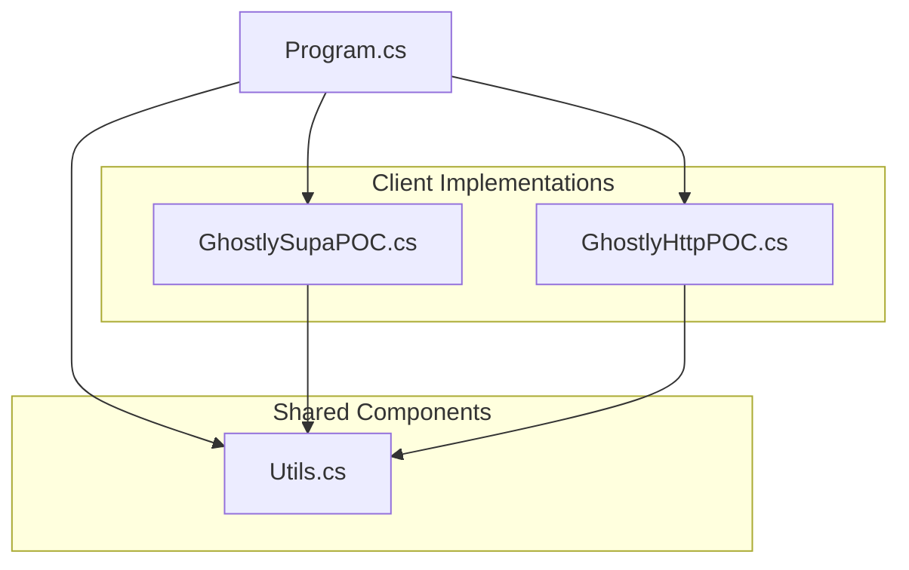
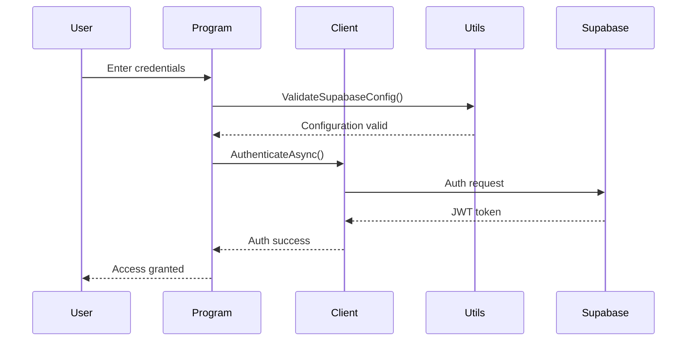
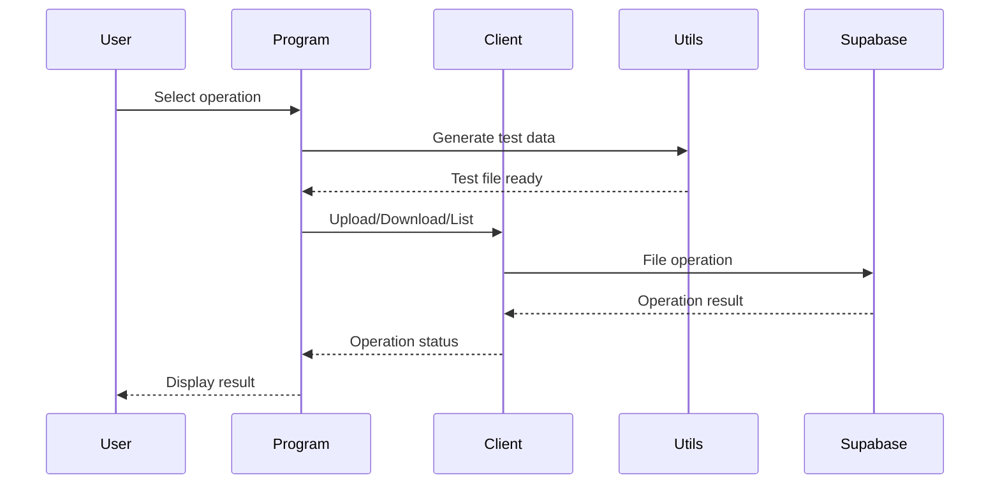

# Components Documentation

This document provides an overview of the key components in the `src/` directory, explaining their purpose and relationships.

```mermaid
graph TD
    subgraph "Application Core"
        Main["main.cs"]
    end

    subgraph "Client Implementations"
        ISupaClient["ISupaClient.cs"]
        SupabaseClient["Clients/SupabaseClient.cs"]
        CustomHttpClient["Clients/CustomHttpClient.cs"]
    end

    subgraph "Security & Testing"
        RlsTests["RlsTests/"]
    end

    subgraph "Supporting Code"
        Config["Config/"]
        Models["Models/"]
        Utils["Utils/"]
    end

    Main --> ISupaClient
    Main --> RlsTests
    Main --> Config
    ISupaClient <|-- SupabaseClient
    ISupaClient <|-- CustomHttpClient
    SupabaseClient --> Models
    CustomHttpClient --> Models
    RlsTests --> Models
```

---

## 1. Application Core (`main.cs`)
-   **Purpose**: Acts as the application's entry point and central orchestrator.
-   **Responsibilities**:
    -   Presents the interactive user menu.
    -   Initializes the client configurations based on user selection.
    -   Calls the appropriate test suites (`RunTestSequence` or `RunRlsPoc`).

## 2. Client Implementations (`src/Clients/`)
This directory contains the interchangeable strategies for communicating with Supabase.

-   **`ISupaClient.cs`**: Defines the common interface that both client implementations adhere to. This ensures they can be used interchangeably by the rest of the application.
-   **`SupabaseClient.cs`**: The implementation that uses the official `supabase-csharp` library. It wraps the library's methods to conform to the `ISupaClient` interface.
-   **`CustomHttpClient.cs`**: The implementation that uses the raw .NET `HttpClient`. This client manually constructs HTTP requests, manages authorization headers, and parses JSON responses.

## 3. RLS Test Suite (`src/RlsTests/`)
-   **Purpose**: Contains the comprehensive test suite for validating the multi-tenant Row-Level Security model.
-   **Responsibilities**:
    -   **`MultiTherapistRlsTests.cs`**: The core test logic. It runs a series of tests to confirm that therapists can only access data belonging to their assigned patients and are blocked from all unauthorized access.
    -   **`RlsTestSetup.cs`**: A helper class that prepares the test environment by creating necessary data (patients, files, etc.) for each therapist before the tests run.

## 4. Supporting Components

-   **`src/Config/`**: Contains `TestConfig.cs`, which is responsible for loading all necessary configuration from environment variables or a `.env` file (e.g., Supabase URL, API keys, test user credentials).
-   **`src/Models/`**: Contains all the C# Plain Old CLR Objects (POCOs) that map to the database tables (e.g., `Patient.cs`, `EmgSession.cs`) or represent API responses.
-   **`src/Utils/`**: Contains shared helper classes for common tasks like writing to the console (`ConsoleHelper.cs`), managing environment variables (`DotEnv.cs`), and custom exceptions (`SecurityFailureException.cs`).

## Core Components

### 1. GhostlyPOC (Supabase Client Implementation)
**File**: `GhostlySupaPOC.cs`
**Purpose**: Implementation using official Supabase C# client
**Key Features**:
- Authentication handling
- File operations with patient folders
- RLS testing capabilities

**Key Methods**:
```csharp
public async Task<bool> AuthenticateAsync(string email, string password)
public async Task<FileUploadResult> UploadFileAsync(string patientCode, string localFilePath)
public async Task<bool> DownloadFileAsync(string fileName, string localPath, string patientCode = null)
public async Task<List<Supabase.Storage.FileObject>> ListFilesAsync(string patientCode = null)
public async Task<bool> TestRLSProtectionAsync(string email, string password)
```

### 2. GhostlyHttpPOC (HTTP Client Implementation)
**File**: `GhostlyHttpPOC.cs`
**Purpose**: Raw HTTP implementation for comparison
**Key Features**:
- Direct API calls to Supabase
- Custom JSON handling
- Manual token management

**Key Methods**:
```csharp
public async Task<bool> AuthenticateAsync(string email, string password)
public async Task<FileUploadResult> UploadFileAsync(string patientCode, string localFilePath)
public async Task<bool> DownloadFileAsync(string fileName, string localPath, string patientCode = null)
public async Task<List<StorageFile>> ListFilesAsync(string patientCode = null)
public async Task<bool> TestRLSProtectionAsync(string email, string password)
```

### 3. Utility Component
**File**: `Utils.cs`
**Purpose**: Shared functionality and helper methods
**Key Features**:
- Environment configuration
- File operations
- Test data generation

**Key Methods**:
```csharp
public static bool ValidateSupabaseConfig(out string supabaseUrl, out string supabaseKey)
public static async Task<string> CreateSampleC3DFileAsync(string patientCode, string outputDirectory = null)
public static string GenerateTestPatientCode(string prefix = "P", int? number = null)
public static void DisplayTestSummary(bool supabaseSuccess, bool httpSuccess, string patientCode)
```

### 4. Program Entry Point
**File**: `main.cs`
**Purpose**: Application orchestration and user interface
**Key Features**:
- Menu-driven interface
- Test execution
- Error handling

**Key Methods**:
```csharp
public static async Task Main(string[] args)
private static async Task<bool> TestSupabaseClient(string supabaseUrl, string supabaseKey, string email, string password)
private static async Task<bool> TestHttpClient(string supabaseUrl, string supabaseKey, string email, string password)
private static async Task TestBothClients(string supabaseUrl, string supabaseKey, string email, string password)
```

## Component Relationships



## Planned Components (Phase 2)

### 1. Data Models
**File**: `Models.cs` (Planned)
**Purpose**: Database entity representations
**Key Classes**:
```csharp
public class Therapist
public class Patient
public class EMGSession
```

### 2. RLS Test Suite
**File**: `RlsTests/MultiTherapistRlsTests.cs`
**Purpose**: Provides a comprehensive suite of tests to validate the Row-Level Security policies for the multi-therapist environment. It ensures that data access is strictly limited to authorized therapists.

**Key Test Scenarios**:
- **Data Isolation**: Verifies that a therapist can only access data (patients, sessions, files) belonging to them and is explicitly blocked from accessing data belonging to other therapists.
- **File Access Control**: Confirms that storage policies correctly prevent unauthorized downloading and uploading of files, even if an attacker knows the direct path.
- **End-to-End Workflow**: Tests the complete process of uploading a file, creating its metadata record in the database, and then successfully retrieving it, all while under RLS constraints.
- **Role Security**: Ensures that users with a therapist role cannot perform actions reserved for administrators.

### 3. Database Operations
**File**: `DatabaseOperations.cs` (Planned)
**Purpose**: Database CRUD operations
**Key Features**:
- Patient management
- Session tracking
- Therapist operations

## Component Interactions

### Authentication Flow


### File Operation Flow


## Component Configuration

### Environment Variables
Required for component operation:
```bash
SUPABASE_URL="https://your-project.supabase.co"
SUPABASE_ANON_KEY="your-anon-key"
```

### File Paths
Standard paths used by components:
```
./c3d-test-download/    # Download directory
./sample_*.txt          # Generated test files
```

## Error Handling

Each component implements specific error handling:

### GhostlyPOC
- Supabase client exceptions
- Authentication failures
- Storage operation errors

### GhostlyHttpPOC
- HTTP request failures
- JSON parsing errors
- Token management issues

### Utils
- Environment configuration errors
- File operation failures
- Test data generation issues

## Testing Strategy

Components are designed for testability:

1. **Unit Tests** (Planned)
   - Individual component testing
   - Mock Supabase responses
   - Error condition testing

2. **Integration Tests** (Current)
   - Cross-component operation
   - Real Supabase interaction
   - Performance comparison

3. **RLS Tests** (Planned)
   - Security policy verification
   - Access control testing
   - Edge case handling 